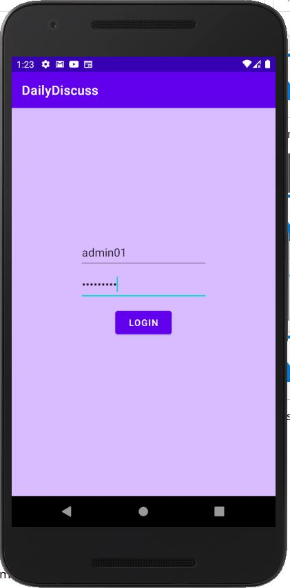
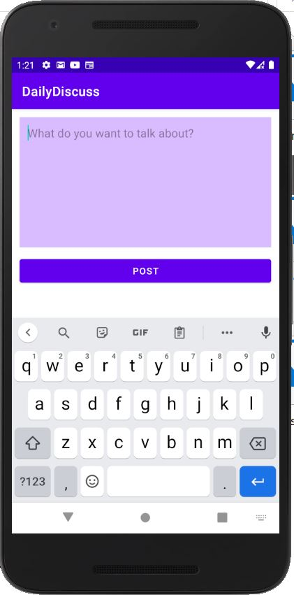

# DailyDiscuss
The app features real-time chatting between different users on daily topics.

The app comes with 2 types of user interface:
1. Admin who creates different daily topics for others to discuss.
2. Public users who gives their opinion on each topic and post their comments. 

- Used google authentication for users login-logout purposes.
- Users can also like each-other's opinion.
- Cloud Firestore is used as the backend NoSQL database to store user details and their chats on each topic.

#### Design of the app:

#### Some glimpses of the app:

